Hi 👋, I'm K47de

<picture>
    <source media="(prefers-color-scheme: dark)" srcset="./profile/stats.svg">
    
</picture>

-   :pencil2: Lua, Lisp, Nix
-   :hammer: Node.js, React, React Native
-   :seedling: Learning Elixir
-   :earth_americas: I'm from Hokkaido, Japan
-   :star: [Projects stared by me](https://github.com/kqnade?tab=stars)
-   :key: PGP Key: [`F19A8A2277AE1A97`](https://github.com/kqnade.gpg)
-   :mailbox: Reach me on [Email](mailto:contact@k4na.de)


<!-- Development stats -->
<h4>📊 Weekly Development breakdown</h4>
<!--START_SECTION:waka-->

```rust
From: 01 April 2026 - To: 08 April 2026

Total Time: 0 secs

No activity tracked
```

<!--END_SECTION:waka-->

<!--


<h4>🔭 I’m currently working on</h4>

-   :moon: [CHaserLua](https://github.com/CHaserClients/CHaserLua) - CHaser written in Lua


<h4>⚡️ Future Projects</h4>

-   :earth_asia: [CHaserJS](https://github.com/CHaserClients/CHaserJS) - CHaser written in JavaScript
-   :milky_way: [CHaserKotlin](https://github.com/CHaserClients/CHaserKotlin) - CHaser written in Kotlin
-  :fire: [lc-lang](https://github.com/kqnade/lc-lang) - A simple language for learning logical circuits
-  :notebook: [bookmarker](https://github.com/kqnade/bookmarker) - A simple cross-platform bookmark manager

<!-- -->

<picture>
    <source media="(prefers-color-scheme: dark)" srcset="https://raw.githubusercontent.com/kqnade/lastfm-stats/refs/heads/main/output/stats.svg">
    
</picture>
<picture>
    <source media="(prefers-color-scheme: dark)" srcset="https://raw.githubusercontent.com/kqnade/lastfm-stats/refs/heads/main/output/top-tracks.svg">
    
</picture>
<picture>
    <source media="(prefers-color-scheme: dark)" srcset="https://raw.githubusercontent.com/kqnade/lastfm-stats/refs/heads/main/output/top-artists.svg">
    
</picture>
